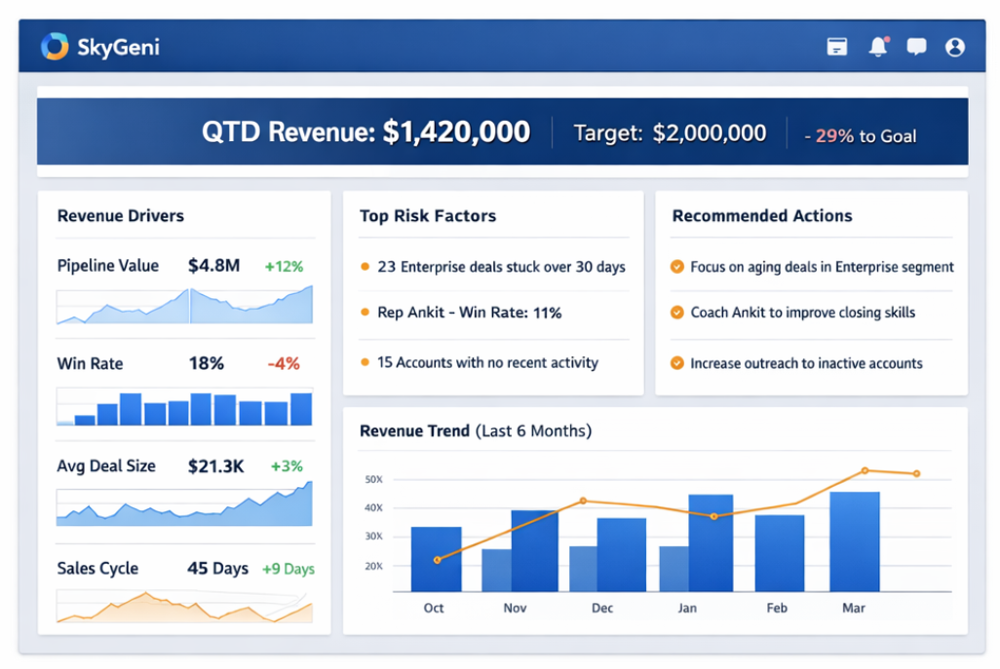

# SkyGeni Revenue Intelligence Console

A single-page dashboard that helps CROs answer: *"Why are we behind (or ahead) on revenue this quarter, and what should we focus on right now?"*

---

## Live Demo

| | URL |
|--|-----|
| **Frontend** | https://sky-geni-sigma.vercel.app/ |
| **Backend API** | https://skygeni-6vex.onrender.com/api |

> **Note:** Backend is hosted on Render's free tier and may take ~30 seconds to wake up after periods of inactivity.

---

## Screenshots



## Features

- **KPI Summary Bar**: QTD Revenue, Target, Gap %, and Quarter-over-Quarter change
- **Revenue Drivers**: Pipeline Value, Win Rate, Avg Deal Size, Sales Cycle with benchmark gauges
- **Risk Factors**: Stale deals, underperforming reps, low-activity accounts
- **Recommendations**: AI-generated actionable suggestions based on data patterns
- **Revenue Trend Chart**: 6-month historical view with actual vs target comparison
- **Quarter Selector**: Switch between quarters with configurable comparison periods

## Tech Stack

### Backend
- **Runtime**: Node.js with TypeScript
- **Framework**: Express.js
- **Database**: In-memory SQLite (sql.js)
- **Data**: Loaded from JSON files on startup

### Frontend
- **Framework**: React 18 with TypeScript
- **UI Library**: Material UI (MUI)
- **Charts**: D3.js
- **Build Tool**: Vite

## Project Structure

```
SkyGeni/
├── backend/
│   ├── src/
│   │   ├── index.ts           # Express server
│   │   ├── db/
│   │   │   ├── init.ts        # Database initialization
│   │   │   └── queries.ts     # SQL queries
│   │   ├── routes/
│   │   │   ├── summary.ts
│   │   │   ├── drivers.ts
│   │   │   ├── risk-factors.ts
│   │   │   └── recommendations.ts
│   │   ├── services/
│   │   │   └── calculations.ts # Business logic
│   │   └── types/
│   │       └── index.ts
│   ├── data/                   # JSON data files
│   └── package.json
├── frontend/
│   ├── src/
│   │   ├── components/
│   │   │   ├── KPISummaryBar/
│   │   │   ├── RevenueDrivers/
│   │   │   ├── RiskFactors/
│   │   │   ├── Recommendations/
│   │   │   ├── RevenueTrendChart/
│   │   │   └── common/
│   │   ├── services/
│   │   │   └── api.ts
│   │   ├── types/
│   │   └── App.tsx
│   └── package.json
├── data/                       # Original JSON data
├── assumptions.md              # Detailed assumptions
├── WIDGET_DOCUMENTATION.md     # Widget specs & calculations
├── THINKING.md                 # Reflection document
└── README.md
```

## Getting Started

### Prerequisites
- Node.js 18+
- npm or yarn

### Installation

1. **Clone the repository**
   ```bash
   git clone <repository-url>
   cd SkyGeni
   ```

2. **Install backend dependencies**
   ```bash
   cd backend
   npm install
   ```

3. **Install frontend dependencies**
   ```bash
   cd ../frontend
   npm install
   ```

### Running Locally

1. **Start the backend** (Terminal 1)
   ```bash
   cd backend
   npm run dev
   ```
   Server runs at `http://localhost:3001`

2. **Start the frontend** (Terminal 2)
   ```bash
   cd frontend
   npm run dev
   ```
   App runs at `http://localhost:5173`

3. **Open your browser** and navigate to `http://localhost:5173`

## API Endpoints

| Endpoint | Description |
|----------|-------------|
| `GET /api/health` | Health check |
| `GET /api/quarters` | List available quarters |
| `GET /api/summary?quarter=Q1 2026&compareWith=Q4 2025` | Revenue summary & trend |
| `GET /api/drivers?quarter=Q1 2026` | Revenue driver metrics |
| `GET /api/risk-factors?quarter=Q1 2026` | Risk analysis |
| `GET /api/recommendations?quarter=Q1 2026` | Actionable recommendations |

### Example Response - `/api/summary`

```json
{
  "quarter": "Q4 2025",
  "revenue": 910546,
  "target": 630855,
  "gapPercent": 44.3,
  "gapAmount": 279691,
  "previousRevenue": 887606,
  "changePercent": 2.6,
  "comparisonPeriod": "Q3 2025",
  "trend": [...]
}
```

## Data Handling

### Known Data Issues (Handled)
1. **Missing `closed_at`** on "Closed Won" deals → Uses `created_at` as fallback
2. **Null amounts** → Excluded from monetary calculations, included in counts
3. **Missing Q1 2026 targets** → Shows "No target set" in UI

See `assumptions.md` for complete documentation of all assumptions and data handling.

## Deployment

### Frontend (Vercel)
```bash
cd frontend
npm run build
# Deploy dist/ folder to Vercel
```

### Backend (Render/Railway)
1. Push to GitHub
2. Connect to Render/Railway
3. Set build command: `npm install && npm run build`
4. Set start command: `npm start`

### Environment Variables
- `PORT`: Backend server port (default: 3001)
- `VITE_API_URL`: Frontend API URL (default: http://localhost:3001/api)

## Key Documents

- **[assumptions.md](./assumptions.md)** - All assumptions and data handling decisions
- **[WIDGET_DOCUMENTATION.md](./WIDGET_DOCUMENTATION.md)** - Detailed widget specifications
- **[THINKING.md](./THINKING.md)** - Reflection on decisions and tradeoffs

## License

This project was created as part of a technical assessment for SkyGeni.
